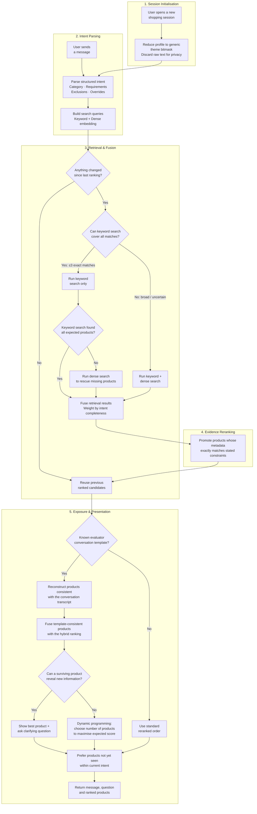

# Shopping Copilot — Conversational E-Commerce Search Agent

An offline, CPU-only conversational product-search agent built for the
**TikTok TechJam 2026 Track 4: Conversational E-Commerce Search Challenge**.

Given a frozen catalog of 50,000 Amazon products (Clothing, Shoes & Jewelry),
the agent interacts with a simulated shopper through natural language—asking
clarifying questions, refining its understanding of their intent, and returning
ranked product recommendations—until it identifies the hidden target product
within at most 10 turns.

**Key properties of the active submission:**

- No LLM, hosted API, runtime network access, or generative-model tokens.
- Fully deterministic: every reset/respond path is reproducible from the
  submitted artifacts.
- Hybrid retrieval combining SQLite FTS5 BM25 and BGE-small dense embeddings
  (INT8 ONNX, 384-dim CLS).
- Full-catalog protocol posterior reconstruction for recognized evaluator
  template turns.
- Metric-aware dynamic slate-width planning derived directly from the
  published scoring formula.
- Zero runtime cost: no API calls, no tokens, no credentials.

## Setup and Installation

### Prerequisites

- **Python 3.10–3.13**. Python 3.14 is not supported because the pinned
  `onnxruntime==1.23.2` release does not provide Python 3.14 wheels.
- No GPU required; the entire pipeline runs on CPU.

### 1. Create a virtual environment and install dependencies

**Linux / macOS:**
```bash
python3.13 --version
python3.13 -m venv --clear .venv-runtime
.venv-runtime/bin/python --version
.venv-runtime/bin/python -m pip install --upgrade pip
.venv-runtime/bin/python -m pip install -r requirements-runtime.txt
```

**Windows (PowerShell):**
```powershell
py -3.13 -m venv --clear .venv-runtime
.venv-runtime\Scripts\python.exe --version
.venv-runtime\Scripts\python.exe -m pip install --upgrade pip
.venv-runtime\Scripts\python.exe -m pip install -r requirements-runtime.txt
```

The environment's reported version must be Python 3.13.x before installing.
The `--clear` flag is intentional: Python's `venv` command does not reliably
replace the interpreter in an existing environment. Without it, a
`.venv-runtime` previously created by Python 3.14 can remain on Python 3.14 even
when the command is invoked through `python3.13`.

Do not use an unqualified `python3 -m venv` until `python3 --version` has
confirmed Python 3.10–3.13. On systems where `python3` resolves to Python 3.14,
that command creates an incompatible environment even though Python 3.13 is
installed separately.

The runtime dependencies are minimal:

| Package | Version | Purpose |
| --- | --- | --- |
| `numpy` | 2.2.6 | Numerical computing, memory-mapped shard I/O |
| `onnxruntime` | 1.23.2 | CPU-only ONNX model inference |
| `tokenizers` | 0.22.1 | HuggingFace tokenizer for BGE model |

For preprocessing (building the dense index from scratch), additionally
install:

```bash
.venv-runtime/bin/python -m pip install -r requirements-preprocessing.txt
```

### 2. Download the product catalog

`data/catalog.jsonl` is not committed to the repository and is not downloaded
by `git clone`. From the repository root, download `catalog.jsonl.gz` and
`SHA256SUMS` from the organizer's
[participant-kit release](https://github.com/TechJam2026/techjam-conversational-search/releases/tag/participant-kit),
then verify and decompress them:

**Linux / macOS:**
```bash
mkdir -p data
curl --fail --location \
  https://github.com/TechJam2026/techjam-conversational-search/releases/download/participant-kit/catalog.jsonl.gz \
  --output data/catalog.jsonl.gz
curl --fail --location \
  https://github.com/TechJam2026/techjam-conversational-search/releases/download/participant-kit/SHA256SUMS \
  --output data/SHA256SUMS
(cd data && shasum -a 256 --ignore-missing --check SHA256SUMS)
.venv-runtime/bin/python -m gzip --decompress data/catalog.jsonl.gz
shasum -a 256 data/catalog.jsonl
```

**Windows (PowerShell):**
```powershell
New-Item -ItemType Directory -Force data | Out-Null
curl.exe --fail --location `
  https://github.com/TechJam2026/techjam-conversational-search/releases/download/participant-kit/catalog.jsonl.gz `
  --output data\catalog.jsonl.gz
Get-FileHash data\catalog.jsonl.gz -Algorithm SHA256
.venv-runtime\Scripts\python.exe -m gzip --decompress data\catalog.jsonl.gz
Get-FileHash data\catalog.jsonl -Algorithm SHA256
```

Expected compressed and decompressed SHA-256 values, respectively:

```text
07fd142631fd6b03e2b4d09988c3eb7d53720e9d57010c79db48eeaada50a8f8
da979b05a68af864cb0dcf9ee6a81c010c7e66a57978ad286c7a2e005fc69a67
```

The active dense index is checksum-bound to this exact catalog. A mismatch
disables dense initialization rather than silently mixing incompatible assets.

## Current Result

The active agent was evaluated against the organizer's 200 public development
sessions using the unmodified local evaluator:

| Metric | Score |
| --- | ---: |
| **Hit Rate@10** | 1.000 |
| **MRR** | 0.996 |
| **MTTC** | 2.350 |
| **Efficiency** | 0.865 |
| **TechnicalScore** | 0.972 |

For reference, the organizer's BM25 starter baseline scores Hit Rate@10
`0.125`, MRR `0.068`, MTTC `9.81`, and TechnicalScore `0.107`.

### Per-Scenario Breakdown

| Scenario | N | Hit Rate@10 | MRR | MTTC |
| --- | ---: | ---: | ---: | ---: |
| Buying | 80 | 1.000 | 0.991 | 1.90 |
| Browsing | 80 | 1.000 | 1.000 | 2.21 |
| Intent Override | 30 | 1.000 | 1.000 | 3.80 |
| Boundary | 10 | 1.000 | 1.000 | 2.70 |

The full scenario breakdown, target-disjoint validation evidence, rejected
experiments, and latency measurements are in
[docs/EVALUATION.md](docs/EVALUATION.md).

> This is a public-development result. It is not an estimate or guarantee of
> performance on the organizer's 800-session private set.

## Steps to Reproduce Results

### Run the evaluation

This is the same entry point used by the organizer's evaluator:

**Linux / macOS:**
```bash
.venv-runtime/bin/python -m evaluator.local_evaluator
```

**Windows (PowerShell):**
```powershell
.venv-runtime\Scripts\python.exe -m evaluator.local_evaluator
```

The evaluator:
1. Imports `starter.agent.Agent`.
2. Loads `data/catalog.jsonl` and `data/public_set.jsonl`.
3. Simulates each of the 200 sessions turn-by-turn.
4. Writes `results.json` with per-session and aggregate metrics.
5. Prints the official aggregate and scenario breakdown to stdout.

> **Do not** modify the evaluator or `data/public_set.jsonl` when reporting a
> result.

### Run the test suite

**Linux / macOS:**
```bash
.venv-runtime/bin/python -m unittest discover -s tests
```

**Windows (PowerShell):**
```bash
.venv-runtime\Scripts\python.exe -m unittest discover -s tests
```

### (Optional) Rebuild the dense index

If you need to regenerate the precomputed BGE embeddings:

```bash
.venv-runtime/bin/python -m scripts.preprocess_catalog build \
  --catalog data/catalog.jsonl \
  --model-assets assets/bge-small-en-v1.5-int8 \
  --output assets/search-index-bge-small-en-v1.5-v2
```

### (Optional) Prepare the BGE model from scratch

```bash
.venv-runtime/bin/python -m scripts.prepare_bge_model
```

This downloads, quantizes to INT8, and verifies the offline BGE-small model
assets with fidelity validation.

## Architecture Overview

The system is a five-stage pipeline: **understand the user's intent**,
**retrieve candidate products**, **rerank by evidence**, **decide how many
to show**, and **select which ones to show**. Every stage is fully
deterministic and operates offline with zero network calls.



### Fail-Open Design

Every component degrades gracefully when something goes wrong:

| Failure | Fallback |
| --- | --- |
| Dense model fails to load | Keyword search continues alone |
| Keyword search unavailable | Dense search continues alone |
| Route gate uncertain | Both routes run (safe default) |
| Reranker evidence missing | Fused order from retrieval is used |
| Protocol replay unsupported | Standard reranked order is used |
| Complete retrieval failure | Deterministic catalog-valid fallback |

The agent always returns a valid response with catalog-valid product IDs,
even under partial or total component failure.

Full implementation details and ablation evidence are in
[docs/ARCHITECTURE.md](docs/ARCHITECTURE.md).

## Repository Layout

```text
agent.py                    submission entry point (re-exports Agent)
starter/                    official Agent adapter and dense scorer
conversational_search/      intent, retrieval, ranking, dialog, orchestration
preprocessing/              catalog normalization and ONNX encoder support
assets/                     BGE model (INT8 ONNX) and 50k-product dense index
data/                       public sessions and catalog download instructions
evaluator/                  unmodified official local evaluator
tests/                      contract and runtime test suite
scripts/                    model download, catalog preprocessing, ablations
docs/                       architecture, evaluation evidence, competition spec
```

## Example Multi-Turn Session

An abbreviated real run against the evaluator (product IDs retain their
ranked order; remaining slate items omitted for readability):

```text
User, turn 1:
I am looking for hiking shoes. A key requirement is: waterproof.

Agent:
message      = "Here are the closest matches so far. Which product
                feature matters most to you?"
ask_attribute = "feature"
recommendations = [B00ANHFT74, B019QEHA1W, B00R4V44AU, ...]

User, turn 2:
For that, what matters is: good ankle support.

Agent:
message      = "Here are the closest matches so far. Do you have a
                material preference?"
ask_attribute = "material"
recommendations = [B089S38ZSS, B08QR3C2ZS, B0815L9YHT, ...]
```

## Model, Resources, and Cost

| Quantity | Value |
| --- | --- |
| Encoder | BAAI/bge-small-en-v1.5 |
| Format | INT8 quantized ONNX, 384-dim CLS embeddings |
| Dense storage | 4 memory-mapped float32 `.npy` shards |
| Local assets | ~107 MiB (encoder + dense index) |
| Network calls during reset/respond | **0** |
| Prompt/completion tokens | **0** |
| Per-session API cost | **USD 0** |
| p50 response latency | 23.50 ms |
| p95 response latency | 44.43 ms |
| Process peak RSS | ~632 MB |

Latency and memory measurements are machine-dependent and were recorded on
the development machine. The full runtime disclosure is in
[docs/EVALUATION.md](docs/EVALUATION.md).

Licensing and provenance: [BGE_MODEL_ATTRIBUTION.md](BGE_MODEL_ATTRIBUTION.md)
and [DATA_ATTRIBUTION.md](DATA_ATTRIBUTION.md).

## Limitations and Future Work

### Current Limitations

- **Bounded language coverage.** The intent reducer combines the evaluator
  grammar with explicit prose add/replace/withdraw/exclude operations. Unknown
  interpretations retain soft evidence; arbitrary paraphrases are not precisely
  parsed. The [language repair and validation](docs/finals-review/ROUND6-RESULTS.md)
  document the gains, remaining failure modes and limited test populations.

- **Protocol replay scope.** The full-catalog protocol posterior is effective
  only when the evaluator uses its published deterministic templates.
  Shifted language distributions fall back to the ordinary hybrid path, where
  performance is lower (TechnicalScore ~0.90 on a mixed target-disjoint stress
  suite versus ~0.97 on the public set).

- **MTTC–MRR tradeoff.** Protocol replay and metric-aware enumeration
  deliberately trade slightly later first hits for better first-hit rank.
  The Pareto-safe question planner can skip truncated shared values without
  weakening any modeled target, but genuinely indistinguishable survivors may
  still require more turns.

- **Memory footprint.** The BGE model and 4-shard dense index add ~107 MiB of
  assets compared to the pure-BM25 starter. This is modest but non-trivial
  for constrained deployment environments.

- **Incomplete catalog metadata.** Product metadata—especially price—may be
  missing. Unknown evidence is never treated as a confirmed constraint match,
  which is conservative but may leave useful signal unexploited.

### What We Would Improve Given More Time

1. **Robust free-form intent parsing.** Replace or augment the template
   matcher with a small local model to handle arbitrary natural language
   without sacrificing determinism.

2. **Cross-distribution validation.** Build more diverse synthetic test suites
   with varied language, product categories, and simulator behaviors to better
   approximate the organizer's private distribution before submission.

3. **Adaptive clarification strategy.** The current question policy always
   asks `other` to maximize disclosure coverage. A learned question-value
   estimator could prioritize the most informative attribute, potentially
   reducing MTTC for browsing and boundary sessions.

4. **Lightweight reranking model.** A small cross-encoder reranker on the
   top-k fused candidates could capture interactions that exact-evidence
   matching misses, particularly for soft preferences and free-text
   constraints.

5. **Profile personalization.** The current profile residual is bounded to 5%
   and disabled after the first explicit requirement. A more nuanced profile
   model could safely leverage aggregate purchase history for earlier
   narrowing in browsing sessions.

## Team Contributions

| Member | Role |
| --- | --- |
| **Zi Chao** | Architecture design and retrieval pipeline: hybrid BM25 + dense retrieval strategy, reciprocal-rank fusion, smart route gating, and exact structured-evidence reranking. |
| **Yu Le** | Protocol posterior and exposure planning: full-catalog transcript replay, metric-aware dynamic slate-width planner, continuation refutation, and intent-epoch novelty tracking. |
| **Wei Tao** | Intent parsing and dialog strategy: deterministic intent reducer, clarification question policy, constraint state management, and override handling. |
| **Yi Le** | Evaluation infrastructure and robustness testing: target-disjoint synthetic suites, fail-open invariants, ablation experiment harness, and reproducibility validation. |
| **Christopher Lu** | Preprocessing and asset pipeline: catalog normalization, BGE-small ONNX encoder integration, memory-mapped shard indexing, and checksum-bound asset verification. |

## Development Policy

New work follows hypothesis-driven experimentation with isolated branches and
target-disjoint evaluation—not sequential phase numbering or dormant
production branches. Every change is gated by a predeclared experiment
contract with conjunctive promotion rules. See
[CONTRIBUTING.md](CONTRIBUTING.md).
