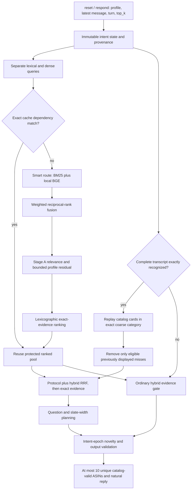

# Architecture before and after the finalist review

The [eighth-round comparison](ROUND8-RESULTS.md#architecture-before-and-after)
adopts bounded conversation corrections and truthful fallback wording. Four
end-to-end accuracy/compatibility gates pass; the fresh language gain is due to
preference-edit handling. A new apparel-opening grammar adds no measured benchmark
gain, and the independent 52-case language challenge fails for both versions.
Retrieval, ranking, models and question policies remain unchanged.

The [seventh-round attribute-index experiment](ROUND7-RESULTS.md) adds an offline
provenance sidecar and two opt-in tie-breaks. Both fail fresh accuracy gates;
neither is enabled. The active architecture at the end of that round was the
accepted sixth round.

The [sixth-round comparison](ROUND6-RESULTS.md#architecture-before-and-after)
adds compositional intent operations while preserving exact protocol recognition.
Its four fresh accuracy gates pass; public responses remain unchanged. The
fifth round's ranking and planning experiments remain disabled.

The earlier [fourth-round comparison](ROUND4-RESULTS.md#architecture-before-and-after)
adds anchored intent forms that correctly revise tentative preferences, and
prunes planner widths whose immediate hit already violates the existing utility
condition. Official outputs are preserved; controlled-language behavior improves.
Its report includes the completed 4,000-target confirmation and trade-offs.

The earlier [third-round comparison](ROUND3-RESULTS.md#architecture-comparison)
records bounded computation reuse and an indexed category query, with the
existing decision policies preserved. Its report states the final validation
and adoption status. The architecture below records the original baseline.

The [second research round](ROUND2-RESULTS.md#architecture-before-and-after)
adds deeper question planners and counterfactual simulation as disabled research
arms. It also retains this submission architecture unchanged.

## Version boundary

The team repository was at `5378908`. The working tree already contained a
Pareto lookahead extension and related documentation/tests. The personal fork
preserves that exact working tree as baseline commit `e4d5dab`.
`baseline-manifest.json` records SHA-256 identities of all 98 tracked files.
The untracked suite generator was also preserved. Local demo outputs and the
untracked Qwen GGUF are not part of the scored agent or this branch.

**At the end of the initial review, all 98 baseline files were unchanged.**
Only review documents, aggregate results, experimental runners, and their tests
had been added. Later accepted personal-fork changes are documented above.
The original team working tree still matches the initial 98 hashes. None of
the research runners is imported by the Agent entrypoint.

## Active runtime, verified against source

| Layer | Implementation and active behavior |
|---|---|
| API | `agent.py` re-exports `starter.agent.Agent`; the adapter pins the submission policies. `reset` isolates session state; `respond` receives no target/scenario label. |
| Intent | `intent.py`: immutable category, requirements, source turns, exclusions, declined/asked attributes, intent version. Active parser is `ROBUST_INTENT_POLICY`; lossless multi-slot remains disabled. |
| Retrieval | `retrieval.py`, `retrieval_routing.py`: SQLite FTS5 BM25 and local BGE-small-en-v1.5 int8 ONNX embeddings, using four precomputed NumPy shards. Exact hard constraints with joint support of one to three products permit BM25-first; missing support triggers dense rescue. |
| Fusion | `strategy.py`, `ranking.py`: weighted RRF with k=60. BM25 weight is `0.4 + 0.2 * completeness`; completeness counts hard requirements plus half-weight soft requirements, capped at three evidence units. |
| Ranking | `exact_evidence.py`: category, literal constraints, transcript consistency, exclusions and soft numeric-price compatibility precede the stable incoming rank. Semantic post-exact tie-break and importance-aware satisfaction experiments are disabled. |
| Profile | `profiles.py`: raw aggregate profile becomes a bounded theme mask. Its residual is at most 5% and is disabled once an explicit requirement exists. No raw purchase-history lookup. |
| Protocol | `protocol.py`, `protocol_index.py`: rebuild cards from visible catalog fields and replay all observed events exactly. Category cap 5,000; fused output pool cap 200. Observed largest category is only 1,354, so the category cap is not currently binding. |
| Negative feedback | Only a continued, exactly recognized, score-eligible turn refutes its displayed ASINs. An override prevents unsafe pre-change refutation and resets the presentation epoch. |
| Question | Repeated `other` drains undisclosed card values. Typed-question lookahead compares predicted utility against that continuation. Unsupported prose returns to ordinary retrieval. |
| Width | Exact singleton: rank one. Unresolved evidence: usually rank one plus a question. Exhausted posterior: finite-horizon dynamic program. Turn ten: full permitted prefix, no question. |
| Cache | `orchestration.py`: bounded exact-dependency cache includes intent, query, policies and backend identity. Any relevant change or uncertain backend invalidates reuse. |
| Failure handling | Independent lexical/dense failure paths, conservative fallback on unsupported protocol text, validated candidate membership, deterministic catalog-valid fallback. No runtime network, credentials, or LLM tokens. |

The utility is `0.5 + 0.3 / rank + 0.02 * (11 - turn)` for a hit and zero for a
miss. This explains why returning ten candidates immediately is often worse
than asking once more and returning the target at rank one.

## What the experiments would have changed

| Component | Before | Experiment | After review |
|---|---|---|---|
| Cold start | Hybrid/protocol ordering | Review-count-first input to exact ranking on an unconstrained first turn | Original ordering retained; net score gain zero, four session regressions |
| Ambiguous slate | Metric-aware widths | Rank one before turn ten on protocol enumeration/Pareto decisions | Dynamic program retained; strict policy lost ten hits |
| Intent parser | Robust parser | Enable existing lossless multi-slot parser | Robust parser retained; 25 session utility regressions and weaker overrides |
| Unsupported opening | Existing robust/free-text fallback | Ground a unique catalog category phrase without rewriting protocol text | Original fallback retained; language score fell and 42 sessions regressed |
| Question planner | Existing protocol lookahead | Compare published answerability/VOI ideas | Existing implementation retained; no reproduced evidence for replacing it |
| Retrieval | BM25 + BGE + complete protocol support | Assess competitor category and memory lanes | Existing implementation retained; exact support already recovers candidates outside the bounded hybrid union |
| Evaluation | Existing public and historical synthetic reports | Frozen paired comparison, fresh targets, explicit rejection gate | Added as research tooling only |

## Limits that should be stated accurately

1. The saved specification allows organizer-added paraphrasing; the workshop
   transcript says no undisclosed paraphrases would be introduced and template
   updates would be published. Identical private wording must not be assumed
   unconditionally. Exact replay is relevant to the released evaluator, but its
   benefit is conditional on recognized wording. The accepted language repairs
   cover bounded sentence forms with literal catalog values, not unrestricted
   natural-language understanding. See the [paraphrase audit](PARAPHRASE-AUDIT.md).
2. The current Pareto planner proves dominance **inside its continuation model**.
   It holds an ordering of survivors while predicting future branches; the live
   service can reretrieve and rerank after replies. It is not a proof of
   universal end-to-end non-regression, nor of optimal ranking or questioning.
   See `exposure.py:507` and `service.py:1720` at the frozen baseline.
3. "Uniform posterior" is an assumption after observable evidence is exhausted.
   The organizer's purchase-derived target distribution need not be uniform.
   Popularity can help that distribution while hurting long-tail targets.
4. Dense evidence is used when the dense route actually runs. A successful
   BM25-first decision may skip it; claims that every session always uses both
   routes overstate the implementation.
5. The catalog contains three disclosure-equivalent groups of 111, 154 and
   264 products. With ten turns and at most ten scored IDs per turn, universal
   success over all such products is information-theoretically impossible.
   This does not imply that all those products are eligible hidden targets.

Source: [official Track 4 document](https://bytedance.larkoffice.com/wiki/GdYFwzWNLiREsSkuIjZcDznInWc#N8Q4dTPyYozbP8xNoIlmMcBUyEc),
user-supplied workshop transcript, and the baseline source files above.
