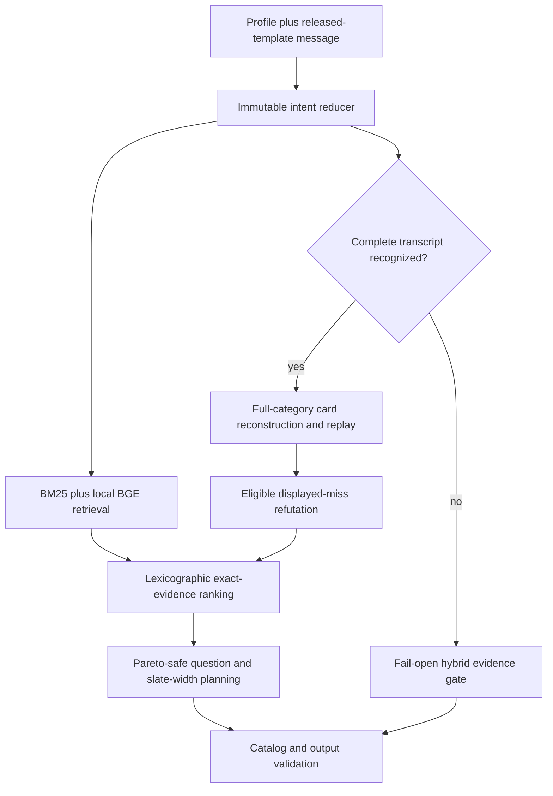

# Round ten final integration decision

## Decision

Retain commit `2234a3d` as the active competition agent. The attempted
purchase-prior and deeper-planning combination is **not promoted**.

This is the strongest result that satisfies the agreed rule: no aggregate
HR@10, MRR, or turn-efficiency regression, a statistically supported gain,
and validation on fresh target-disjoint sessions. Several experiments improve
the public score, but every new runtime combination fails at least one part of
that rule. Shipping one would replace measured robustness with a public-score
bet.

The active agent contains no LLM, generative model, network request,
credential, or token use.

## Competition assumption from the workshop

The workshop is the primary operational source for the final evaluation: the
private 800 follows the released evaluator templates, no undisclosed
natural-language paraphrases will be introduced, and any template change will
be published through a revised evaluator with representative examples before
submission. The saved specification conditionally permits such a published
revision; it does not establish that one will occur.

The final architecture therefore gives exact released-template replay the
competition path. Bounded natural-language parsing and BM25+BGE retrieval remain
as fallback coverage, without an LLM.

## Final active architecture

| Layer | Active behavior at `2234a3d` |
|---|---|
| Intent | Deterministic add, replace, remove, exclude, and no-preference operations with provenance and override protection |
| Retrieval | SQLite FTS5 BM25 plus local BGE-small INT8 ONNX, combined by weighted reciprocal-rank fusion |
| Exact protocol | Reconstruct all cards in the exact category and replay every released-template turn |
| Ranking | Category, literal constraints, transcript consistency, exclusions, and price compatibility before stable retrieval rank |
| Feedback | Refute only displayed misses after an eligible continuation; reset presentation state across intent changes |
| Planning | Per-target Pareto guard, repeated `other` disclosure, and finite-horizon enumeration when evidence is exhausted |
| Reliability | Bounded exact-dependency caches, independent lexical/dense fallback, unique catalog-valid output checks |
| Models | Local BGE embeddings only; no LLM or generative inference |

Compared with the protected architecture at the start of round ten, the final
runtime is unchanged. The wider finalist review already added the accepted
intent corrections, exact protocol controller, Pareto planning, and safe cache
reuse documented in [Architecture before and after](ARCHITECTURE-BEFORE-AFTER.md).

## Same-runtime evaluation

All figures below use Python 3.13.15, the unchanged organizer evaluator, the
same catalog, and BGE enabled. The fresh suite contains 1,600 target-disjoint
sessions sampled without replacement with weight `rating_number + 1`.

| Candidate | Public result | Fresh purchase-derived result | Decision |
|---|---|---|---|
| **Active `2234a3d`** | HR 1.000000, MRR 0.996250, MTTC 2.350000, score 0.971875 | HR 0.998750, MRR 0.981143, MTTC 2.611250, score 0.961493 | Retain |
| Full integration: cold slate + purchase probe + two-step plan | HR 1.000000, MRR 1.000000, MTTC 2.060000, score 0.978800 | HR 0.998750, MRR 0.980055, MTTC 2.561250, score 0.962167 | Reject: MRR −0.001088 |
| Purchase probe + two-step plan, cold slate removed | HR 1.000000, MRR 1.000000, MTTC 2.195000, score 0.976100 | HR 0.998750, MRR 0.980055, MTTC 2.559375, score 0.962204 | Reject: MRR −0.001088 |
| Guarded purchase probe only | Not used for selection | HR 0.998750, MRR 0.980755, MTTC 2.573125, score 0.962139 | Reject: MRR −0.000388 |
| Two-step planner only | Not used for selection | HR 0.998750, MRR 0.981436, MTTC 2.602500, score 0.961756 | Reject: corrected bootstrap lower bound −0.000411 |
| Exact popularity cold prior only | HR 1.000000, MRR 0.996250, MTTC 2.215000, score 0.974575 | HR 0.998750, MRR 0.981143, MTTC 2.613125, score 0.961455 | Reject: MTTC +0.001875 |
| Per-target-safe deeper planner | Byte-identical to active public output; mean response 197 ms | Not run after zero public change | Reject: no gain and large runtime cost |

The two-step-only point estimates all improve or remain equal on the fresh
suite, but 19 sessions regress while 25 improve. Its family-corrected one-sided
bootstrap lower bound is below zero. That is insufficient statistical evidence:
the measured mean gain does not rule out sampling noise at the declared
confidence level.

An isolation run initially appeared to make the purchase probe improve every
metric. Its temporary package was missing `starter/dense.py`, so the service
silently used its supported lexical fallback. The result was excluded and both
arms were rerun with the identical BGE loader. The table contains only the
corrected measurements.

All accepted/rejected results use target-blind policies. No planner receives a
sample ID, scenario label, target ASIN, evaluator result, or public-product
exception.

## Competitor position

The active agent's public score remains below Kopi O(1)'s reproduced 0.9796 and
ARC's unverified reported 0.9804. Public-maximizing variants can close or exceed
that gap, but they failed hidden-style gates. Kopi's accessible implementation
also lost fourteen hits relative to this agent on the earlier fresh uniform
800, supporting the decision to retain semantic retrieval and full-catalog
protocol replay.

The differentiation to present to judges is the complete system rather than a
single public-score trick:

1. Exact released templates get complete-category reachability and deterministic
   transcript replay.
2. Unsupported language retains BM25+BGE semantic retrieval and deterministic
   preference edits.
3. The question planner uses per-target utility dominance rather than only an
   average public score.
4. Every promoted change has a frozen non-regression record; attractive failures
   remain reproducible research evidence.

This does not prove a private-800 win, because the organizer labels and complete
ARC/Fable7 implementations are unavailable. It is the strongest validated
submission in the personal fork under the agreed promotion standard.

## Submission checklist

1. Check Devpost and the finalist Telegram group for a revised evaluator. If
   none exists, keep the released-template controller.
2. Run `python -m unittest discover -s tests` and the unchanged public evaluator
   in the final submission environment.
3. Confirm the public response SHA-256 is
   `617ed260db8fedc5f1add9054f515afc8cfb2aac05c742794864b66b404b6417`.
4. Submit from the personal fork only after team review; no team branch or pull
   request is created by this round.
