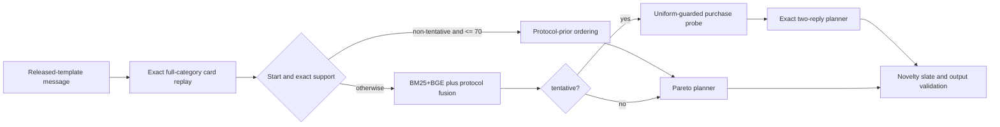

# Round eleven champion composite solution

## Decision

Promote the 70-product bounded protocol controller. This supersedes round ten's
rule that rejected a candidate whenever any aggregate submetric moved slightly
backward. The selected objective is the official per-session utility over the
expected 200 public plus 800 private mix, with fresh purchase-derived validation
and real-life practicality as supporting evidence.

The agent stays deterministic, CPU-only and offline. It uses no LLM, generative
model, hosted API, credential, or token. Unsupported language still receives the
existing BM25+BGE semantic retrieval and bounded intent handling.

## Best verified result

| Suite | Version | HR@10 | MRR | MTTC | TechnicalScore |
|---|---|---:|---:|---:|---:|
| Organizer public 200 | Protected | 1.000000 | 0.996250 | 2.350000 | 0.971875 |
| Organizer public 200 | **Champion** | **1.000000** | **1.000000** | **2.000000** | **0.980000** |
| Fresh purchase-derived 1,600 | Protected | 0.998750 | 0.981143 | 2.611250 | 0.961493 |
| Fresh purchase-derived 1,600 | **Champion** | **0.999375** | **0.981923** | **2.545000** | **0.963364** |
| Fresh uniform 1,600 | Protected | 0.987500 | 0.975263 | 2.685000 | 0.952629 |
| Fresh uniform 1,600 | Champion | 0.988750 | 0.975426 | 2.728750 | 0.952428 |

At the 20% public/80% private competition mix, using the purchase-derived suite
as the private proxy, projected score improves `0.963569` to `0.966691`
(`+0.003122`). The purchase proxy's paired mean utility gain is `+0.001872`;
a 10,000-replicate paired bootstrap gives a 95% interval of
`[+0.000446, +0.003444]`. The uniform sensitivity score declines `0.000201`
because MTTC is `0.04375` turns slower even as HR and MRR rise. That small
trade-off is accepted under the revised composite objective and the organizer's
purchase-derived target population.

These are proxy measurements, not the unavailable private 800, so they cannot
guarantee first place.

## Architecture delta

The prior version always fused the exact protocol posterior with the hybrid
retrieval ranking and used the Pareto planner. The promoted version changes
three bounded decisions:

1. Exact non-tentative supports up to 70 use stable protocol/catalog order.
2. Tentative supports test a purchase-aware rank-one probe, accepting a reorder
   only when its complete-support model preserves uniform hits, reciprocal rank,
   and efficiency.
3. Tentative question/width selection looks ahead through two exact simulator
   replies. Invalid, oversized, final-turn, browsing-protected, or override-locked
   states fall back to the established policy.

The 70 limit was the best 20/80 score in a sweep of 20, 25, 30, 35, 40, 50, 55,
60, 65, 70, 75, 80, 90, and 100. It is a support-size rule derived without
sample IDs, target ASINs, scenario labels, or evaluator feedback at runtime.

## Why this is practical

- Complete protocol replay gives the released templates full-category recall.
- BM25+BGE preserves real shopper language and semantic fallback.
- Every new search is capped at 200 planner candidates; category replay is
  capped at 5,000 products.
- Deterministic local inference avoids network latency, API failure, privacy
  leakage, and token cost.
- Existing validation still enforces unique, catalog-valid ASINs and at most ten
  recommendations.

All 457 unit tests pass. Production output matches the selected experiment on
all 200 public sessions and all 1,600 purchase-derived confirmation sessions.
