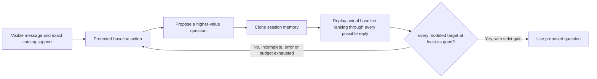

# ARC / Fable7 deep review and independent improvement experiments

7 September 2026. Personal fork only. Baseline: `08cd1f1`.

**Decision: retain the current submission agent.** Five additional research arms
were implemented and tested. None clears the existing non-regression gate. The
0.99 objective was not reached, and beating ARC/Fable7 has not been established.
Their inaccessible source prevents a controlled head-to-head evaluation.

## What the public material actually establishes

I read the refreshed Devpost stories, their linked public update posts, ARC's
four gallery images, and the complete auto-generated English transcripts of
both videos. I rechecked both linked GitHub repositories and the authors' public
repository lists. Both project repositories still return 404; no renamed public
Track 4 repository was found in those lists. A 404 does not establish why access
is unavailable. There is no evidence here of a concealed model breakthrough.

ARC's [current story](https://devpost.com/software/constraintflow-shopping-copilot)
describes answerability-aware question value, evidence-first ranking with a
bounded popularity contribution, complete-signature ties, and finite-horizon
output widths. Its reported public score is 0.980400. Our existing system already
has full-transcript catalog support, continuation refutation, selective exposure,
and a finite-horizon enumeration planner. The unresolved opportunity is better
future-action modeling and ranking within still-compatible candidates.

ARC's [video](https://www.youtube.com/watch?v=2yUYXPNMEwI), around 7:30–8:35,
explicitly describes a deterministic implementation with no hidden model call
and no trained RL/POMDP model. It reports an earlier 0.9772 score, MRR 0.993 and
MTTC 2.04; the current page and performance image report later values. The demo
does not independently verify the current submission. Its strongest presentation
feature is a visible explanation of evidence, rejected items and action timing.

Fable7's [story](https://devpost.com/software/fable7) describes three lexical
retrieval routes, exact evidence, a 16-feature linear pairwise ranker and
dialogue-prefix matching. A fine-tuned TinyBERT was evaluated but disabled. Its
[video](https://www.youtube.com/watch?v=-7QWSWkh2mw), around 1:22–2:36, identifies
prefix matching, selective output and candidate rotation as the decisive gains.
Those mechanisms are already substantially covered by our current architecture.
Its claimed public score remains 0.978; inaccessible source prevents reproduction.

Auto-generated captions can contain transcription errors. No competitor source
or full transcript is copied into the submitted agent or committed to this fork.
The linked update posts contain no additional technical specification. The two
teams' independently generated diagnostic scores are not head-to-head results.

## Reproduced results

All entries below use our unchanged official evaluator, the same frozen catalog
and the same 800 development sessions as round one. These 800 are synthetic,
exclude the public targets and are not the organizer's hidden set. The four
initial hypotheses were recorded before their outputs were inspected.

| Agent / explicit research arm | Public score | Dev HR@10 | Dev MRR | Dev MTTC ↓ | Dev score | Sessions harmed / 800 |
|---|---:|---:|---:|---:|---:|---:|
| Protected baseline | 0.971875 | 0.990000 | 0.974892 | 2.562500 | 0.956218 | — |
| Full-support cold-start reviews | 0.974575 | 0.990000 | 0.974892 | 2.562500 | 0.956218 | 5 |
| Full-support review prior at all exact turns | 0.979750 | 0.990000 | 0.975052 | 2.588750 | 0.955741 | 45 |
| One-step answer value | 0.971675 | 0.990000 | 0.975517 | 2.558750 | 0.956480 | 7 |
| Two-step action value | 0.971800 | 0.990000 | 0.976972 | 2.546250 | 0.957167 | 8 |
| Counterfactual question shield | Not run | 0.990000 | 0.974892 | 2.562500 | 0.956218 | 0; no gain |

The all-turn review prior approaches ARC's reported public result while harming
the shared development result. Public improvement alone would have selected the
wrong change. The two-step planner improves mean development utility by
0.000949107, but harms eight sessions and the override scenario. Its corrected
one-sided bootstrap lower bound is negative. Neither is safe to promote under
the team's requested non-regression rule.

The one-step and two-step models keep candidate order fixed when predicting
future rankings. Live retrieval/reranking can reorder those survivors. This is
an explicit modeling approximation, not a proof of optimal interaction.
The first four measured arms produced no exceptions, invalid responses or
instrumented planner errors. Concurrent measurements are not a speed comparison.

## Our independent counterfactual safety check

The follow-up research arm snapshots the current session before processing its
message. It proposes a different question, then runs the actual protected
baseline through every catalog-consistent future reply branch. It admits the
proposal only when every modeled target receives at least its baseline utility
and at least one receives more. These candidate IDs are possible catalog worlds,
not the actual evaluator target. The evaluator's sample/scenario/target labels
never enter the agent API.



The gate covers complete supports up to the existing 200-candidate limit, before
turn nine, with pending overrides and ambiguous first-turn boundary states
excluded. A 512-call limit bounds each attempted certificate. Unsupported inputs
retain the baseline. This remains conditional on the published simulator and a
deterministic backend; it is not a claim about arbitrary human conversation.

It reached 445 eligible states and assessed 30 different-question proposals,
using 4,742 actual baseline simulation calls. All 30 were rejected, with zero
errors and zero exhausted call budgets. Its response SHA-256 exactly matches
the baseline's across all 800 sessions, not just its rounded score. The measured
mean response time was 135 ms and the maximum 13.23 seconds: the computation is
too expensive to enable without a benefit. Earlier coverage-only diagnostics
are retained and described in [the plan](ROUND2-PLAN.md).

This result does not prove the baseline globally optimal. The shield screened
one proposed question per eligible state; it did not exhaust every conceivable
policy, ranking or language interpretation.

## Architecture before and after

| Layer | Before this round | After this round |
|---|---|---|
| Submission retrieval, parsing, ranking and exposure | Existing protected configuration | Byte-identical |
| Research question planning | Fixed-order Pareto / prior ablations | Added one-step value, two-step value and actual-backend counterfactual shield |
| Experimental priors | Bounded reranking probe | Added full exact-support cold-start and all-turn review priors |
| Evaluation | Paired session gate | Configurable family correction and internal-planner-error rejection |
| Evidence audit | Catalog ambiguity counts | Added independently tested optimistic metric ceilings |

Nothing under `agent.py`, `starter/`, `conversational_search/`, `evaluator/`, or
the model assets changed. The new implementations are explicit research imports
under `scripts/`. The team repository was not pushed and no team PR was created.

All 98 original tracked files still match the initial working-tree hashes.
The complete test suite passes 378 tests, including a real-agent shadow replay
test checking output equality, memory isolation and backend token identity.
The tests also cover indistinguishable-target capacity, rendered-reply collisions,
candidate completeness and promotion rejection when an internal planner fails.

## Where the remaining opportunity lies

The public/development reversal in the review-prior experiment is evidence of a
distribution-sensitive ranking trade-off. Better calibration may improve the
finals score, but choosing it from the public 200 would violate our evidence
standard. More forceful exposure similarly trades rank quality against coverage.
Neither should be enabled on the claim of a guaranteed improvement.

For the final presentation, explain the existing exact-support guarantee, show
how one disclosure changes the candidate set, and distinguish information that
has not yet arrived from retrieval failure. Our strongest defensible technical
story includes controlled rejected experiments and a quantified observability
limit. The current results do not justify claiming 0.99, universal superiority,
or a proven win over inaccessible competitors.

## What 0.99 would require

For the official metric:

`Score = 0.5 HR + 0.3 MRR + 0.02 (11 − MTTC)`

Even with perfect HR and MRR, score 0.99 requires MTTC at most 1.5. A normalized
efficiency of 0.99 would require MTTC 1.1. Override sessions cannot score before
their scheduled third/fourth turn. Boundary sessions can score on their first
recommendation, so treating an extra refusal turn as universally unavoidable
would be incorrect.

The catalog also contains products with identical observable disclosure cards.
I independently computed an optimistic oracle bound: grant the entire card free
before the first response, then solve the best legal slate schedule for each
indistinguishable group. The hidden product within a group remains unknown.

| Uniform full-catalog population assumption | Maximum expected HR | Maximum expected MRR | Maximum expected score |
|---|---:|---:|---:|
| All sessions eligible at turn 1, all clues already given | 0.995420 | 0.983911 | 0.987457 |
| Additionally model 15% overrides, half at turn 3 and half at 4 | 0.995153 | 0.983439 | 0.979805 |

These are population expectation ceilings under uniform targets and profiles
independent of targets. They are not hard limits for a particular finite sample,
the public set, purchase-weighted targets or the unknown hidden distribution.
Each metric is optimized separately; the listed maxima need not be jointly
achievable. The audit does not use private labels or enter the runtime.

The calculation makes a precise distinction: 0.99 remains an aspiration for the
unknown finals distribution, but demanding it simultaneously on a uniform
long-tail population is mathematically incompatible with the available evidence.
See [oracle output](observability-ceilings.json) and the independently tested
[audit implementation](../../scripts/audit_observability.py).

## Reproduce and review

Use the Python environment described in [REPRODUCE.md](REPRODUCE.md). From the
personal checkout, with the frozen round-one data one directory above:

```bash
python -m scripts.benchmark_finalists --arm two_step_value \
  --dataset ../development.jsonl --output ../round2/development-two_step_value.json
python -m scripts.compare_finalist_results \
  ../development-baseline-instrumented.json ../round2/development-two_step_value.json \
  --family-size 4 --output ../round2/two-step-paired.json
python -m scripts.benchmark_finalists --arm counterfactual_shield \
  --dataset ../development.jsonl --output ../round2/development-counterfactual_shield.json
python -m scripts.audit_observability \
  --output ../round2/observability-ceilings.json
python -m unittest discover -s tests
```

The original 1,600 confirmation sessions remain reserved for a candidate that
clears development and stress. Aggregates, hashes and rejected experiments are
recorded; target-level outputs stay in ignored local research files.
Because all candidates failed development, no additional language or confirmation
scores were consumed for promotion. Public diagnostics were run once for the
four initial arms; the zero-gain shield did not warrant a public-score run.
See [aggregate results](round2-results-summary.json),
[source inventory](round2-sources.json), and [the frozen plan](ROUND2-PLAN.md).
