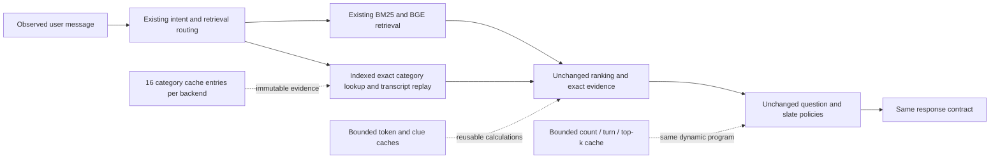

# Round 3: preserve accuracy, remove repeated computation

**Decision: adopt the runtime optimization in the personal fork.** All four
frozen suites preserve every response and per-session outcome. Three alternating
timing pairs per suite show lower median total runtime and p95 latency, with
positive paired timing confidence bounds. The four accuracy alternatives remain
disabled. There is no new accuracy gain or demonstrated .99 technical score.

The performance change is isolated in commit `743a636`; the following research
commit contains the comparison tooling and reports. Both belong to the personal
branch `codex/finals-evidence-review`.

## Verified before/after results

Each accuracy entry below is **identical before and after**, including unrounded
per-session outcomes. The confirmation 1,600 were untouched until this candidate
passed development/public/stress and its source fingerprint was frozen.

| Suite | HR | MRR | MTTC | Turn efficiency | Technical score |
|---|---:|---:|---:|---:|---:|
| Public 200 | 1.000000 | 0.996250 | 2.350000 | 0.865000 | 0.971875 |
| Development 800 | 0.990000 | 0.974892 | 2.562500 | 0.843750 | 0.956218 |
| Language stress 200 | 0.845000 | 0.565690 | 3.665000 | 0.733500 | 0.738907 |
| Fresh confirmation 1,600 | 0.995000 | 0.982847 | 2.534375 | 0.846562 | 0.961667 |

Median fresh-process timings include startup in total time. Three paired
runs per suite; all measurements, not just the fastest runs, are retained.

| Suite | Total seconds before → after | Time reduction | p95 milliseconds before → after |
|---|---:|---:|---:|
| Public | 20.545 → 18.074 | 12.03% | 73.729 → 58.994 |
| Development | 81.103 → 70.072 | 13.60% | 77.311 → 64.655 |
| Stress | 22.319 → 21.394 | 4.15% | 59.283 → 56.639 |
| Confirmation | 147.620 → 125.228 | 15.17% | 74.409 → 59.036 |

| Suite | Mean paired session saving (ms) | One-sided lower bound (ms) | Alpha |
|---|---:|---:|---:|
| Development | 14.225 | 12.035 | 0.008333 |
| Public | 12.689 | 10.158 | 0.008333 |
| Stress | 3.853 | 3.213 | 0.008333 |
| Confirmation | 12.708 | 11.856 | 0.050000 |

The memory trade-off is bounded reuse rather than free computation. Median
whole-process peak RSS (baseline → candidate MiB) was: development 609.3 → 612.1; public 647.8 → 664.7; stress 636.9 → 651.4; confirmation 609.0 → 622.1.
RSS includes the evaluator, catalog and model, and varies with process/memory
mapping behavior; it is not an isolated cache-allocation measurement.

Confirmation startup alone had a median of 3.829 → 4.057 seconds. This component increased; it remains included in the total-runtime gate.
The claim is lower aggregate runtime and p95, not a decrease in every resource component.

All 390 tests pass. All 98 originally tracked files in the team working
tree still match their initial byte hashes. The official evaluator and model
assets are unchanged. No team branch or PR was created by this round.

The full aggregate evidence, identities and all timing repetitions are in
[round3-results-summary.json](round3-results-summary.json).

## Controlled competitor comparison on the same 1,600

These runs use the previously reviewed, pinned source snapshots and our
unchanged official evaluator/catalog. The accuracy advantage, where shown,
already existed in our baseline; the runtime optimization preserves it.

| Agent | HR | MRR | MTTC ↓ | Score | Our paired score gain | Adjusted lower bound |
|---|---:|---:|---:|---:|---:|---:|
| i anything, before = after | 0.995000 | 0.982847 | 2.534375 | 0.961667 | — | — |
| Kopi | 0.984375 | 0.976660 | 2.803750 | 0.949110 | 0.012556 | 0.008096 |
| Vibe | 0.988125 | 0.968361 | 2.767500 | 0.949221 | 0.012446 | 0.008762 |
| Shreyansh | 0.981875 | 0.716080 | 2.623750 | 0.873287 | 0.088380 | 0.081094 |

Paired bounds use 20,000 bootstrap draws and alpha .05/3. These are controlled
comparisons on this synthetic suite, not the organizer's hidden labels. ARC
and Fable7 cannot be included without accessible source; their published
scores on different datasets do not establish a head-to-head result.

On this suite, our successful-target set contains every target found by each
of these three competitors, plus 17 additional hits over Kopi, 11 over Vibe and
21 over Shreyansh. Individual utility losses still occur and are recorded in
the paired reports; the measured advantage is aggregate, not every-session
dominance. Competitor runs overlapped after our timing study ended, so their
recorded latencies are not a controlled speed comparison against ours.

The protected baseline is the finalist runtime at `5e59d21`. The user explicitly
replaced the individual-session veto with aggregate non-regression, statistically
supported gains and fresh validation. HR, MRR and turn efficiency remain separate
constraints: a higher weighted score cannot conceal a decline in one of them.
See [the frozen plan and declared follow-ups](ROUND3-PLAN.md).

## What the intelligence experiments established

All four use the same consumed 800 development sessions, unchanged official
evaluator and frozen catalog. No target label or scenario label enters the
agent API. These are synthetic target-disjoint sessions, not the hidden 800.

| Research arm | HR | MRR | MTTC ↓ | Score | Decision |
|---|---:|---:|---:|---:|---|
| Protected baseline | .990000 | .974892 | 2.562500 | .956218 | Reference |
| Direct exact-support prior | .990000 | .975052 | 2.588750 | .955741 | Turn efficiency regresses |
| Direct support + answer value | .990000 | .975718 | 2.585000 | .956015 | Turn efficiency regresses |
| Joint early probe + question | .990000 | .974645 | 2.560000 | .956193 | MRR regresses |
| Baseline rank + full continuation question value | .990000 | .974892 | 2.558750 | .956293 | Gain is not statistically supported |

The last arm saves three total first-hit turns across 800 sessions; four
sessions improve and two regress. Its multiplicity-adjusted paired-bootstrap
lower bound is −.000075, despite a positive mean score change of .000075.
The individual regressions are reported, but they are not the rejection reason
under the revised rule. The small gain has insufficient statistical support.

The direct-support controllers avoid every retrieval call on these recognized
sessions and are substantially faster. However, direct review-count ordering
changes results. That trade-off prevents adoption. The early-probe controller
changes the first candidate in 144 states but does not produce a net score gain.
No new accuracy claim, public-score optimization or hidden-label inference is
justified by these results.

The direct-prior arm reproduces every per-session outcome of round two's
full-support review-prior arm. Removing the later retrieval/evidence passes
did not uncover an additional accuracy gain on this suite. The observed
trade-off comes from changing candidate order; the successful optimization
direction preserves that order and reuses its underlying calculations.

## The runtime change

Profiling recorded about 4.04 million clue-classification calls, 292,000
significant-token calls and 17,277 enumeration-plan calls in one development
evaluation. It also reconstructed category evidence at every response. These
counts identify repeatable work; the profiled run is not used as a fair latency
baseline.

The expanded candidate changes four files under `conversational_search/`:

| Calculation | Before | After |
|---|---|---|
| Attribute classification | Reclassify identical clue text in simulated branches | Cache up to 8,192 normalized strings of at most 180 characters; long text uses the original calculation |
| Stage-A tokenization | Normalize and tokenize recurring document text | Cache up to 512 immutable token tuples for inputs of at most 4,096 characters; preserve Unicode behavior, order and duplicate tokens |
| Exact category evidence | Query and reconstruct cards on each turn | Keep 16 immutable category tuples per backend, keyed by snapshot identity and exact category; recheck availability before reuse |
| Category query | Binary equality could not use the existing NOCASE index | Retain binary equality and add a logically redundant NOCASE equality, enabling the existing index without merging case-distinct categories |
| Exhausted-support planning | Rebuild the same dynamic program in different branches | Cache up to 8,192 results keyed only by survivor count, turn and top-k |

The first runtime candidate included classification, category and enumeration
caches only. It preserved all responses and improved development/public timing,
but failed the literal stress gate: median total time was 0.09% slower and p95
was 1.24% higher. Its full 18-run timing record is retained; it was not promoted
and did not consume confirmation. The second candidate adds tokenization reuse
and the indexed exact lookup, as declared before its measurements.

## Measurement and acceptance

Baseline runs execute in a separate source archive of `5e59d21`; candidate runs
execute the ordinary submission entry point in the personal checkout. Both use
the same instrumented runner, Python runtime, catalog and bundled model assets.
Each suite has three sequential fresh-process pairs, alternating execution order
as baseline/candidate, candidate/baseline, baseline/candidate. No benchmark agents
run concurrently during these timing studies.

Every paired result must match both complete per-session outcomes and the SHA-256
of all response dictionaries. This includes questions, recommendation order,
message text and token usage. Runtime source, catalog, dataset, wording and
evaluator identities are retained. Scores rounded to six decimals alone do not
establish equivalence.

Aggregate runtime means cold start plus complete evaluation. Median p95 response
latency must also not increase. Startup is reported separately, not excluded
from total time. Timing confidence intervals resample sessions rather than
correlated turns, using the median paired saving over three repetitions and
20,000 bootstrap draws. Development/public use alpha .05/6 for the two runtime
hypotheses and three development suites. Confirmation uses alpha .05. Stress
requires non-regression rather than a separate positive speed-gain claim.

Repeated runs are hardware-local measurements, not a guarantee about the judges'
CPU or every future process schedule. Bounded caches exchange some memory for
less repeated computation; process peak RSS is recorded with every run.

## Architecture comparison

The decision architecture is retained: immutable intent state → smart BM25/BGE
retrieval → exact evidence and full transcript support → eligible continuation
refutation → question/width planning → validated novelty-aware output. The
optimization changes how repeated pure results are obtained, not their meaning.

Frozen catalog/snapshot semantics are required for category reuse. New assets
require a new backend identity. Cache hits cannot authorize product removal,
change a prior or suppress an intent correction. Backend availability is checked
before reuse, and failed category loads are not cached.

## What this means for the championship goal

No .99 accuracy breakthrough or win over ARC/Fable7 has been demonstrated.
Our higher-priority competitive story is complete evidence coverage, correct
feedback handling, deliberate uncertainty management and verifiable compute
efficiency. The largest observed practical weakness remains natural-language
preference revision outside the released templates.

The [championship strategy](CHAMPIONSHIP-STRATEGY.md) gives a concrete demo
sequence, judging evidence, technical priorities and Q&A preparation. It also
separates technical score from turn efficiency: .99 in every metric is not
feasible for a suite with 15% overrides that cannot score before turn three.
