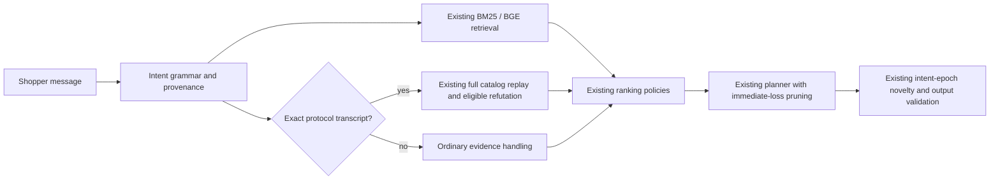

# Round four: repair preference revision and prune dominated plans

**Decision: adopt the intent repair and exact planner pruning in the personal fork.**
Runtime commit: [`5d5588f`](https://github.com/mysterious-joker/TTSC/commit/5d5588f2e413cf982532e0f9760041ff17243772).
All seven development/confirmation suite gates passed. The three confirmation
suites contain 4,000 new targets, opened only after the candidate was frozen.
The baseline is personal commit `1ef7440`, including round three's accepted
caches. No ranking-prior experiment is enabled. Official public score remains
**.971875**; this round has not demonstrated .99 or a championship guarantee.

## What changed

The intent reducer missed common prose punctuation and opening forms. A
tentative preference could consequently enter memory as undifferentiated text,
so a later explicit replacement failed to remove it. The repaired anchored
grammar recognizes those openings, requirements, contextual answers, declines
and replacements while retaining literal values and their provenance. It
withdraws an opening tentative preference while preserving confirmed answers.

This improves ordinary hybrid-search intent handling. It does not reclassify
paraphrases as exact simulator events, authorize protocol-only refutation, add
a model call, or change the ranking policies. The tests cover decimal budgets,
colon-containing values, semicolon-separated evidence, retained confirmations,
and quoted/questioned replacement language that must not withdraw a preference.

The planner also stops exploring a width when an immediate hit at that rank
already loses utility against the modeled baseline. Every wider prefix retains
that target at the same rank; a question cannot repair an already scored hit.
This exact pruning preserves the original tolerance and action choice. A
differential check against the previous source matched all 256 generated belief
states, including cases that prefer a typed question over `other`.

## Development validation

| Suite | HR before → after | MRR before → after | MTTC before → after | Score before → after |
|---|---|---|---|---|
| Public 200 | 1 → 1 | .996250 → .996250 | 2.350 → 2.350 | **.971875 → .971875** |
| Old uniform development 800 | .990000 → .990000 | .974892 → .974892 | 2.5625 → 2.5625 | .956218 → .956218 |
| Existing paraphrase stress 200 | .845000 → .960000 | .565690 → .820218 | 3.665 → 2.520 | .738907 → .895665 |
| New weighted punctuation development 800 | .821250 → .957500 | .539446 → .795056 | 3.81875 → 2.595 | .716084 → .885367 |

All official public/development responses match byte-for-byte through response
digests, not merely rounded scores. On the existing 25-case paraphrased override
slice, HR rises from .08 to .96 and average first-hit turn falls from 10.6 to
4.08. This is a controlled language diagnostic, not an organizer-hidden score.

Both language suites pass aggregate HR/MRR/turn-efficiency non-regression and
paired score confidence tests at alpha .05/8. The score-gain lower bounds are
.104753 and .139403 respectively. Individual losses remain: the 200-case suite
has 103 improvements, 22 regressions, 25 gained hits and two lost hits; the
800-case suite has 416 improvements, 90 regressions, 122 gained hits and 13 lost
hits. The latter boundary subgroup loses mean utility. These are disclosed
trade-offs under the user's aggregate rule, not every-session dominance.

Three fresh-process pairs per suite alternate baseline/candidate order. Median
times include startup. Each timing confidence bound resamples sessions rather
than treating correlated turns as independent observations.

| Suite | Total seconds before → after | Reduction | p95 milliseconds before → after |
|---|---:|---:|---:|
| Uniform development | 62.634 → 59.582 | 4.87% | 58.316 → 52.757 |
| Public | 16.639 → 15.877 | 4.58% | 53.826 → 48.879 |
| Paraphrase stress | 20.597 → 16.154 | 21.57% | 54.518 → 47.529 |
| Weighted punctuation | 77.713 → 55.903 | 28.06% | 62.441 → 55.217 |

All four timing gates pass, including positive adjusted lower bounds and
non-increasing p95. Median process peak RSS is also lower in these four studies;
the full process includes evaluator/catalog/model memory. Hardware-local timings
do not guarantee the same speedup on the judges' machine.

## Fresh confirmation

Three sequential alternating pairs reproduced the following outcomes:

| Fresh synthetic suite | HR before → after | MRR before → after | MTTC before → after | Score before → after |
|---|---|---|---|---|
| Uniform, official wording, 1,600 | .994375 → .994375 | .983011 → .983011 | 2.594375 → 2.594375 | **.960203 → .960203** |
| Review-weighted punctuation, 1,600 | .821250 → .965625 | .556351 → .788681 | 3.75125 → 2.54875 | **.722505 → .888442** |
| Category-balanced paraphrase, 800 | .847500 → .986250 | .559919 → .828295 | 3.13875 → 1.95875 | **.748951 → .922438** |

The uniform suite preserves every session outcome and complete response digest.
Both language suites improve all three aggregate accuracy metrics. Paired score
gain lower bounds at alpha .05/8 are **.144414** and **.143238**, with 20,000
bootstrap draws. These quantify uncertainty within these synthetic populations;
they do not estimate performance on the organizer's unknown purchase population.

Preference replacement is the largest repair: the 240 weighted-language override
sessions rise from **7.08% to 96.25% HR**, and the 120 category-language overrides
rise from **2.50% to 98.33% HR**. Individual losses remain. Weighted language has
788 improved / 211 regressed sessions, 252 gained hits and 21 lost hits; category
language has 440 improved / 93 regressed sessions, 118 gained hits and seven lost
hits. Category-language buying HR falls from .990625 to .975 and MTTC rises from
1.509375 to 1.584375 while its MRR improves. The accepted rule is non-regression
for each suite's aggregate metrics, not each scenario or individual session.

| Fresh suite | Median total seconds before → after | Reduction | p95 milliseconds before → after | Paired session-saving lower bound, ms |
|---|---:|---:|---:|---:|
| Uniform official | 122.737 → 115.640 | 5.78% | 57.996 → 53.219 | 3.490 |
| Weighted language | 146.469 → 106.413 | 27.35% | 58.912 → 52.059 | 23.260 |
| Category language | 64.502 → 45.324 | 29.73% | 62.582 → 55.457 | 21.578 |

Total time includes startup; reductions above are calculated from the median
paired speedup. The timing lower bounds use alpha .05/3 and session-block
resampling across three process pairs. All runtime and p95 gates pass, with
zero exceptions and invalid outputs. Peak process RSS medians fall from
691.2 → 674.4 MiB, 697.3 → 692.6 MiB and 677.3 → 675.8 MiB respectively.
Mean per-call language latency rises slightly (24.919 → 25.459 ms and
25.391 → 26.685 ms); fewer calls reduce total effort and p95 also improves.
Thus this is not a claim that every call becomes faster. Timings are incremental
against the already optimized round-three baseline, on the same local machine.

The complete 5,600 newly generated targets (development plus confirmation) are
mutually disjoint and exclude the earlier 2,600 public and synthetic targets.
Profiles remain independent of target choice. Freshness here concerns target
selection: language scaffolds are fixed, developed transforms that preserve
literal catalog values. These tests do not establish arbitrary paraphrase,
multilingual or semantic attribute understanding. All 4,000 confirmation targets
are now consumed and cannot be advertised as fresh for subsequently tuned code.

The source/wording fingerprint frozen before confirmation is
`6854a8e65190af677f6aa41b0a370daa9704dee28f4b67d30ca83c7ab3385a49`.
No runtime or research source changed during or after confirmation. These are
synthetic targets, not the organizer's private 800. The saved specification
allows organizer-added paraphrasing, while the workshop transcript says no
undisclosed paraphrases would be introduced. Identical hidden wording is not an
unconditional guarantee. These language gains establish robustness on the tested
fixed forms with literal catalog values; they do not estimate a hidden score or
validate unseen wording families. The official-wording improvement demonstrated
here is lower computation at identical outputs. See the
[2026-09-08 language coverage audit](PARAPHRASE-AUDIT.md).

The [aggregate evidence bundle](round4-results-summary.json) records both
validation stages, all seven rejected ranking arms, source/data identities,
pruning checks and the previous-confirmation replay. Raw targets and transcripts
remain in ignored local research outputs.

After the primary timing study, the previously consumed round-three 1,600 was
replayed once. All session outcomes and responses match, retaining score
**.961667** and digest
`2f7876b60a06e8876b97e4ef8e36417707ea0afb4bf0e6b8ed9f86942bbfacba`.
This preserves the earlier controlled comparison with the three runnable
competitors; it is not a new holdout or a comparison with ARC/Fable7.

## Seven ranking hypotheses rejected

| Hypothesis | Public score | Old uniform score | Screening failure |
|---|---:|---:|---|
| Category-only cold prior | .974575 | .956218 | Three extra turns on category-balanced development |
| All first-turn prior | .977775 | .956030 | Uniform-development MRR and turn efficiency |
| Fixed 2:1 prior/semantic RRF | .974050 | .956618 | Uniform-development turn efficiency |
| Uniquely recoverable probe | .974275 | .956143 | Three extra uniform-development turns |
| Ambiguity-directed probe | .971975 | .956255 | One extra category-development turn |
| Cold prior + ambiguity probe | .974675 | .956230 | Four extra category-development turns |
| Tenfold review-margin probe | .973675 | .956168 | Uniform- and category-development turn efficiency |

The new weighted/category suites were defined before their outcomes were
inspected. The hypotheses and their follow-ups are recorded in
[ROUND4-PLAN.md](ROUND4-PLAN.md), including all failures and the separate language
intervention. No candidate was promoted simply for a favorable public result.

## Architecture before and after

| Layer | Baseline | Accepted personal-fork architecture |
|---|---|---|
| Intent input | Some ordinary punctuation/openings fall into generic text | Anchored forms retain category, tentative/confirmed provenance and replacement semantics |
| Exact protocol authority | Strict recognized transcript only | Same boundary; natural prose remains on the ordinary evidence path |
| Retrieval and ranking | Smart BM25/BGE, exact evidence, complete transcript support | Same policies and official outputs; better active intent improves language inputs |
| Question/width planner | Simulate widths before rejecting a known immediate rank loss | Stop the width search once its fixed prefix already violates the existing utility condition |
| Efficiency | Accepted bounded caches and indexed category queries | Same caches plus exact pruning and fewer turns on repaired language inputs |
| Evaluation | Public plus uniform synthetic and one language stress suite | Explicit distribution audit, new disjoint sensitivity suites, frozen language/official confirmation |

The [distribution audit](DISTRIBUTION-AUDIT.md) explains why high public scores
do not prove overfitting: public target median review count is 6,846 versus 12
in our earlier uniform development set. Freshness does not fix population
mismatch. The [competitor access addendum](COMPETITOR-ACCESS-ADDENDUM.md) separates
indexed ARC/Fable7 documentation from the complete source we still could not
obtain. No hidden-score superiority over those teams has been established.

All 404 tests pass. The original team working tree's 98 tracked files still
match the initial review hashes. Work remains confined to the personal checkout;
no team PR or team branch push is part of this round.
