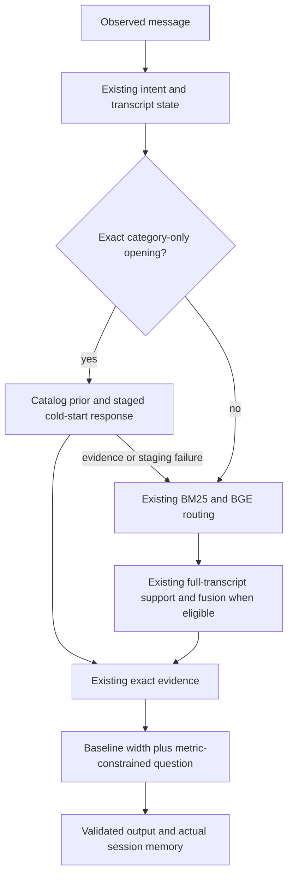

# Round five: improve accuracy before optimizing runtime

**Status: rejected after independent replication. No round-five policy is
promoted. The accepted round-four agent remains active.** The protected baseline is personal-fork
commit `26866df`. All original 98 team files remain unchanged.

The user changed the work order to accuracy first, then runtime. Ten concrete
accuracy hypotheses were tested, plus one unused combination slot retained in
multiplicity correction. Higher public scores alone did not determine selection.
The selected candidate preserves aggregate hit rate, MRR and turn efficiency on
all five consumed suites. The more aggressive replay planners fail that rule.

## Rejected candidate architecture: cold prior plus metric-constrained questions

On an exactly recognized first message containing only a category, use the
existing catalog review-count order. Once requirements arrive, retain the
original hybrid/protocol fusion and exact-evidence ranking. The first-turn path
defers hybrid retrieval whose order this policy would discard. It does not
invent a hybrid ranking-cache entry; a later unchanged query runs normal search
when needed. If complete evidence or a staged decision is unavailable, it falls
back to the ordinary pipeline before committing a slate.

Question selection starts with the original Pareto planner's action and keeps
its width. It forecasts hits, reciprocal ranks and turn efficiency for each
allowed question, admitting only questions whose modeled totals are each at
least the baseline action's totals. Among those, it maximizes the published
weighted utility; ties preserve the baseline. Support must be complete and no
larger than 200. Replies are grouped by their visible text, not latent card
structure. Unsupported and locked transcripts keep their existing policy.

The forecast assumes fixed survivor order in later turns. Its metric constraint
is a model property, not a guarantee about live retrieval or the private target
population. It uses no target labels, sample IDs, fitted coefficients or public
lookup table. Catalog popularity is a prior, not a calibrated probability.

A shared 8,192-entry cache reuses immutable reply predictions. Keys preserve
ordered and duplicate card values, the normalized attribute and relevant
previous disclosures; titles and unrelated text cannot affect predictions.
All argument validation and boundary handling precede caching. An exact upper
bound also stops question comparisons when the baseline already attains the
best possible next-turn utility at the same displayed width.

| Component | Accepted round four and final active agent | Rejected round-five candidate |
|---|---|---|
| Category-only exact opening | Hybrid/protocol RRF | Catalog prior; hybrid work deferred |
| Constrained and later ranking | Hybrid/protocol RRF plus exact evidence | Same |
| Question comparison | Pointwise utility constraint in a modeled continuation | Keep that action's width; compare aggregate hits, reciprocal ranks and turn efficiency separately |
| Enumeration, override eligibility and refutation | Existing finite-horizon and feedback rules | Same |
| Ordinary language | Repaired intent provenance, BM25 and BGE fallback | Same; controlled-language responses remain identical |
| Added computation | Existing bounded caches | Shared bounded reply cache and exact question stopping bound |

Final before/after decision: the active columns are identical because the
candidate is rejected. The personal fork adds reproducible research policies,
tests, validators and evidence, while the release adapter keeps round four's
hybrid fusion and Pareto-safe question policy. This avoids turning a public-only
gain into a private-evaluation regression.

## Consumed development results

These are selection evidence; they are not the private 800 or fresh confirmation.

| Suite | Hit rate before → candidate | MRR before → candidate | Average turns before → candidate | Score before → candidate |
|---|---:|---:|---:|---:|
| Public 200 | 1.000 → 1.000 | .996250 → .996250 | 2.350 → 2.215 | .971875 → **.974575** |
| Uniform 800 | .990 → .990 | .974892 → .974892 | 2.56250 → 2.55875 | .956218 → .956293 |
| Review-weighted 800 | .99625 → .99625 | .982606 → .982606 | 2.52625 → 2.50875 | .962382 → .962732 |
| Category-balanced 800 | 1.000 → 1.000 | .999375 → .999375 | 2.00500 → 2.00375 | .979713 → .979738 |
| Controlled language 200 | .960 → .960 | .820218 → .820218 | 2.520 → 2.520 | .895665 → .895665 |

Public first-turn hits increase from **33 to 53**. At alpha .05/11, the paired
public score-gain lower bound is **.001100**. There are 22 improved sessions, two
regressions and 176 unchanged sessions, with no lost hits. Individual losses are
allowed by the user's aggregate rule and remain reported.

The weighted-development bound is **zero** after correction for all eleven
slots; its mean gain is not independently established. Earlier .05/7 reports
had a positive bound and remain historical evidence, not a current .05/11 claim.
Uniform/category gains are also too small to claim statistical significance.
A comparator fix prevents a floating-point residue around 4e-19 from being
misreported as a positive confidence bound.

The selected implementation matches the research prototype's complete responses
on all four official suites and the protected controlled-language responses.
All **413 tests pass**. Added checks cover cold-start/ordinary-path state
agreement through a later boundary reply, evidence-failure fallback, ordinary
language routing, hypothetical-state isolation and significance at numerical
zero. An independent 180-decision generated-world comparison finds no changes
from the question stopping bound.

## Why the higher-scoring research candidates were not selected

| Hypothesis | Public result, when tested | Rejection evidence |
|---|---|---|
| Rank one on ordinary language | Not a public-policy change | Language HR .960 → .925; seven lost hits; more turns despite higher MRR |
| Review prior on ordinary-language candidates | Not a public-policy change | Language HR, MRR and turn efficiency all decline |
| All first-turn prior plus one-step question value | .977775 | Uniform MRR and turn efficiency decline |
| Cold prior plus one-step question value | .974575 | Weighted MRR declines .000833333 |
| Cold prior plus scalar full continuation | .974575 | Same weighted MRR decline |
| Joint product/question, uniform model | .976800 | Uniform turn efficiency declines .000375 |
| Joint product/question, dual target models | .977600 | Uniform turn efficiency declines .000875; total score also declines slightly |
| Actual-policy rollout verification | **.978500; HR 1.0 and MRR 1.0** | Uniform needs three more total turns; weighted MRR declines .000104167; category needs 19 more turns |
| Actual-policy verification with strict uniform expected gain | .974975 | Uniform MRR declines .001000; weighted MRR declines .000104167 |

The actual-policy verifier considers every compatible catalog hypothesis and
branches only on visible replies, using isolated copies of real service state.
It removes the fixed-order assumption from the final decision check, but still
relies on the declared target priors. Conditional expected improvement does not
guarantee improvement on a finite sample. The stricter rule removes the measured
category regression but fails MRR elsewhere. Neither version is enabled in the
submission adapter.

The valid .978500 public experiment accepts 61 of 67 proposals, makes 4,947
hypothetical continuation calls, and has zero errors. Its public gain has a
positive adjusted bound, but the cross-suite regressions disqualify it. Its
181.66-second evaluation is an overlapping-run diagnostic, not a clean runtime
comparison. The initial implementation screen with 12 proposal-execution errors
is retained separately and excluded from accuracy claims. Corrected execution
preserves question-free enumeration and does not leak simulated feedback into
real session memory. The stricter variant is preserved as a small
[reproduction patch](experiments/strict-gain.patch).

## Frozen selection and fresh validation

Before opening any reserved outcomes, exploration closed at eleven slots.
Selection requires component non-regression on every consumed suite, unchanged
language behavior, zero errors, and a positive corrected public score bound.
Among survivors, the rule chooses the largest mean score across the three
non-public official development suites. Only the cold/vector candidate survives
development selection, but its later independent tests reject promotion.

This explicitly amends the earlier additional requirement for a significant
weighted-development gain. It is an adaptive selection change on consumed data,
not a claim that the earlier gate passed. The final independent test retains its
prospective requirement for a positive weighted score bound and component
non-regression on every fresh suite. See the full chronology in
[ROUND5-PLAN.md](ROUND5-PLAN.md).

Frozen candidate source and wording fingerprint:
`65b6693b3a199910520788250e28fbd4266e5f96e9eb8ddffbeb55dbb00756e3`.
Baseline fingerprint:
`6854a8e65190af677f6aa41b0a370daa9704dee28f4b67d30ca83c7ab3385a49`.

The reserved 4,000 targets exclude all previous 8,200 targets and each other:
uniform official 1,600; square-root-review-weighted official 1,600;
category-balanced controlled language 800. Generation seed is 202609085. Only
one selected accuracy candidate may face these outcomes. Require each suite's
HR/MRR/turn efficiency not to decrease, a positive weighted score-gain bound at
alpha .05/11, identical language responses and zero errors. No tuning follows
opening the confirmation outcomes.

The first confirmation stops at its weighted significance gate:

| Fresh suite | HR before → candidate | MRR before → candidate | Average turns before → candidate | Score before → candidate |
|---|---:|---:|---:|---:|
| Uniform 1,600 | .99375 → .99375 | .979522 → .979554 | 2.545625 → 2.541875 | .959819 → .959904 |
| Weighted 1,600 | .99750 → .99750 | .983402 → .983506 | 2.530000 → 2.511875 | .963171 → .963564 |

Every component's point estimate is non-decreasing, with zero errors, but the
weighted .05/11 lower bound is **-.00003125**. The predeclared gate fails; the
positive mean is not a passing confirmatory result. The uniform gain is also
not separately significant. The reserved language 800 was not opened.

One terminal, independent replication was preregistered and run on the
**unchanged** frozen candidate: 6,400 new weighted targets, seed 202609086,
excluding all 12,200 prior or reserved targets, followed by the unopened language
800. Its new primary bound uses alpha .05/22 and must be positive; every
aggregate metric must be non-decreasing. No old results are pooled into that
primary test. The original failed gate remains reported. The sum of the two
primary test levels is below .007. If the terminal test fails, the candidate
is rejected without more accuracy looks or tuning in this round.

The replication data SHA-256 is
`c7f6874ca283b73db346aa7b74ed3ef6838df5d63d0fd4925c8f3b0068e5770a`.
The [replication driver](experiments/replicate-fixed-accuracy.py) checks the
unchanged source, exclusions, data identity and the original failure reason.
The terminal replication rejects the candidate:

| Terminal fresh weighted suite | HR before → candidate | MRR delta | Average-turn delta | Score before → candidate |
|---|---:|---:|---:|---:|
| Weighted 6,400 | unchanged | **−.000026042** | −.004531 | .962231 → .962314 |

The score point estimate is slightly positive, but MRR regresses and the
corrected score-gain lower bound is **−.000134022** at alpha .05/22. There are
94 improved, 84 regressed and 6,222 unchanged sessions, with no gained or lost
hits. This violates both component non-regression and the significance rule.
The driver stops before opening the reserved language 800. Per the predeclared
terminal rule, there are no more accuracy looks or tuning in this round.

The candidate is rejected. Its code, fingerprints, failed results and research
implementations remain available, while `starter.agent.Agent` continues to
select the accepted round-four architecture.

Final release verification reproduces the protected agent exactly on public 200
and uniform development 800, including complete response digests and every
session outcome. It records zero exceptions or invalid outputs. All 413 tests
pass. See [the aggregate verification](round5-active-verification.json).

## Runtime remains the second stage

Earlier v1 failed weighted median total time: 57.288 → 58.055 seconds (+1.34%),
with p95 52.283 → 53.230 ms. V2 then failed uniform timing (speedup .982684,
about 1.76% slower). Its apparent weighted speedup is not claimed: baseline
elapsed times varied from 58.17 to 98.76 seconds under asymmetric machine load.
Every run is retained.

V3's planned runtime acceptance does not run because the terminal accuracy
replication fails. Overlapping research runs establish no speed claim. The
accepted round-four runtime and its previously validated optimizations remain
active.

## What we can and cannot claim against competitors

The selected public score .974575 remains below Kopi's reproduced .979600 and
the published, unverified ARC/Fable7 claims. The .978500 research trial achieves
perfect public hit rate and MRR but is not a release recommendation. Earlier
controlled comparisons on different, now-consumed targets do not establish a
lead on the private 800. Complete runnable ARC/Fable7 source remains unavailable
for a controlled comparison; see the [access addendum](COMPETITOR-ACCESS-ADDENDUM.md).

These synthetic populations test distribution sensitivity. They do not model
the organizer's unknown purchase-derived sample, and the language transforms
retain literal catalog values. Neither .99 across every metric nor a champion
placement is established. A stronger pitch should show the actual retained
architecture, rejected public-only gains and the independent evidence.
